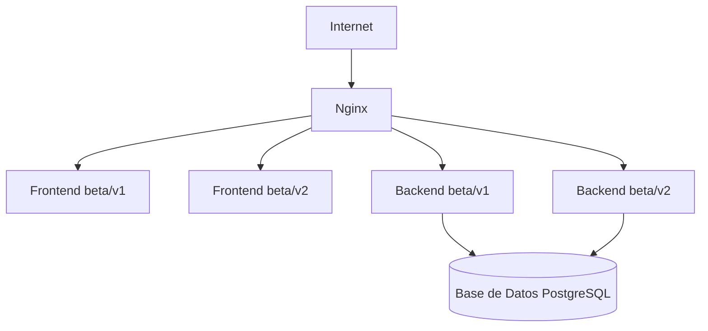

# Estrategia de Versionado para Dashboard-Orchestra

## Arquitectura General

Se implementan dos versiones de la aplicación usando un solo código base, diferenciando el comportamiento mediante variables de entorno y lógica condicional. Ambas versiones (beta/v1 y beta/v2) corren en el mismo VPS, cada una en su propio contenedor (frontend y backend), compartiendo la misma base de datos PostgreSQL y usando Nginx como reverse proxy para enrutar el tráfico.



- **Un solo repositorio**: No se duplican archivos ni carpetas. Todo el código está centralizado.
- **Variables de entorno**: Cada instancia usa su propio archivo `.env` para definir el modo de operación (`MODE=beta_v1` o `MODE=beta_v2`).
- **Lógica condicional**: El código revisa la variable `MODE` para activar o desactivar funcionalidades específicas de cada versión.
- **Base de datos compartida**: Se utiliza un solo esquema, diferenciando usuarios y datos por versión mediante un campo como `beta_version` o `user_type`.

## Implementación Real de la Lógica de Versiones

### Backend (Flask)
- Se creó un decorador reutilizable `require_version` en `utils/version_control.py`:
  ```python
  def require_version(allowed_versions):
      ... # Verifica si la versión actual está permitida, si no aborta con 403
  ```
- Este decorador se aplica a todos los endpoints sensibles (registro, login, recuperación de contraseña, perfil, etc.) para que **solo estén disponibles en beta_v2**:
  ```python
  @auth_bp.route('/register', methods=['POST'])
  @require_version('beta_v2')
  def register():
      ...
  ```
- Si el backend está en modo `beta_v1`, estos endpoints devuelven 403 Forbidden.
- El prefijo de las rutas de la API incluye la versión:
  `/api/beta_v1/...` o `/api/beta_v2/...` según la variable de entorno `MODE`.

### Frontend (React)
- Se usan variables de entorno en `.env`:
  ```env
  REACT_APP_API_URL=http://localhost:5000/api
  REACT_APP_MODE=beta_v1
  ```
- Se construye la URL base de la API dinámicamente:
  ```js
  const API_MODE = process.env.REACT_APP_MODE || 'beta_v1';
  const API_URL = process.env.REACT_APP_API_URL || 'http://localhost:5000/api';
  const API_BASE_URL = `${API_URL}/${API_MODE}`;
  // Ejemplo de uso:
  axios.post(`${API_BASE_URL}/auth/register`, ...)
  ```
- Así, el frontend siempre llama a la versión correcta de la API según el modo.

### Ejemplo de Lógica Condicional en Componentes
- En el frontend, se puede mostrar u ocultar componentes según el modo:
  ```jsx
  const mode = process.env.REACT_APP_MODE;
  return (
    <div>
      {mode === "beta_v2" && <BotonFavoritos />}
      {mode === "beta_v1" && (
        <p className="text-gray-500">Funcionalidad solo disponible en beta v2</p>
      )}
    </div>
  );
  ```

## Despliegue

- **Servicios en el VPS**: Frontend y backend de ambas versiones, base de datos PostgreSQL y Nginx.
- **Docker Compose**: Facilita el levantamiento de los servicios, cada uno con su archivo `.env` correspondiente.
- **Nginx**: Enruta el tráfico a cada frontend/backend según subdominio o ruta.

## Control de Acceso y Datos

- Un solo modelo de usuario, con un campo para distinguir la versión.
- Rate limiting solo para v1.
- Funcionalidades avanzadas solo para v2 (autenticación, favoritos, compras, perfil, etc.).
- Endpoints sensibles protegidos con el decorador `require_version`.

## Ventajas

- Mantenimiento sencillo y centralizado.
- Flexibilidad para agregar más versiones o entornos.
- Un solo punto de análisis y migración de datos.

---

**Resumen:**

La diferenciación de versiones se logra con variables de entorno y lógica condicional, permitiendo mantener un solo código base y facilitar el despliegue, mantenimiento y escalabilidad del sistema. Ambas versiones pueden convivir en el mismo VPS, compartiendo recursos y base de datos, pero con comportamientos y accesos controlados desde la configuración y el código.
